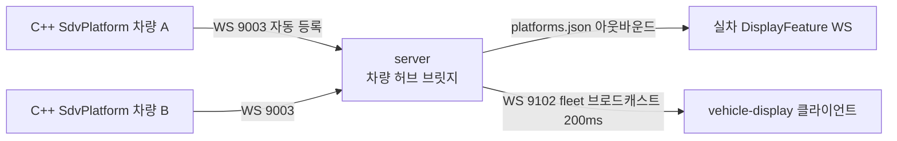

# sdv-demo

현대자동차 산학협력 **SDV 기능플래그(OTA) 플랫폼**의 3D 시각화 데모 — **Three.js · Node.js WebSocket 브릿지**

C++ SDV 플랫폼(차량)들의 위치·주행 상태를 실시간으로 수집해, 각 차량 화면이 다른 차량의 위치를 지도 위에 표시할 수 있게 중계하는 데모입니다.

## 시스템 구성

| 구성 | 역할 | 저장소 |
| --- | --- | --- |
| SDV 플랫폼 본체 (C++) | 기능플래그 OTA 플랫폼 · 차량 측 Feature | 별도 저장소 (비공개/팀 소유) |
| **sdv-demo** | 3D 시각화 프론트엔드 + 차량 WebSocket 브릿지 서버 | (이 저장소) |

이 저장소는 두 부분으로 나뉩니다.

- **루트** — Vite 8 + React 19 + Three.js 기반 3D 시각화 프론트엔드 (현재 커밋에는 `index.html`·Vite/TS 설정만 포함되어 있고 `src/`는 미포함)
- **`server/`** — Node.js 브릿지 서버 (Express + ws)



## 핵심 동작 (server/)

- **차량 자동 등록** — C++ 플랫폼이 WS 9003에 접속해 `register(vin)` 메시지를 보내면 서버가 `Map<vin, state>`에 등록하고 색상을 자동 배정합니다. 재접속 시 위치 상태를 리셋해 이전 좌표 때문에 새 위치가 점프 필터에 걸리는 문제를 방지합니다.
- **아웃바운드 연결** — `config/platforms.json`에 등록한 실차의 DisplayFeature WS에는 브릿지가 클라이언트로 직접 접속하며, 끊기면 5초 후 자동 재시도합니다.
- **좌표 검증** — 맵 범위를 크게 벗어나거나 직전 위치에서 250유닛 이상 순간이동한 좌표는 C++ 초기값/노이즈로 판단해 폐기합니다. `angle`이 없으면 이동 벡터로 방향을 계산하고, DisplayFeature의 고정 좌표와 NavigationFeature의 실제 주행 좌표가 번갈아 튀지 않도록 분리 처리합니다.
- **fleet 브로드캐스트** — 200ms 주기로 접속 차량 전체의 위치·속도·조향 스냅샷을 WS 9102의 디스플레이 클라이언트에 송신합니다. 각 차량 화면이 이 스트림으로 다른 차량 위치를 지도에 올립니다.
- **도로 매핑** — 서울 주요 도로 그래프(노드 10개 · 엣지 15개, 도로 유형·제한속도 포함)를 내장하고, 최근접 엣지 계산으로 스냅샷의 차량마다 현재 도로명·제한속도를 부여합니다. 세그먼트 좌표를 로드 시 1회 평탄화하고 제곱거리로만 비교(sqrt 생략)하는 등 매 틱 호출되는 핫패스를 최적화했습니다.

## 기술 스택

- 프론트엔드: Vite 8 · React 19 · TypeScript · Three.js 0.184
- 서버: Node.js 20 · Express · ws · Docker

## 실행

```bash
# 프론트엔드 (루트)
npm install
npm run dev            # :5173

# 브릿지 서버
cd server
npm install
npm start              # HTTP 3030 (상태) · WS 9003 (차량 허브) · WS 9102 (fleet)
```

실차 연동은 `server/config/platforms.example.json`을 `platforms.json`으로 복사해 차량의 host/port를 등록한 뒤 서버를 재시작합니다. 컨테이너 배포용 `server/Dockerfile`(node:20-alpine, 3030/9003/9102 노출)을 포함합니다.
